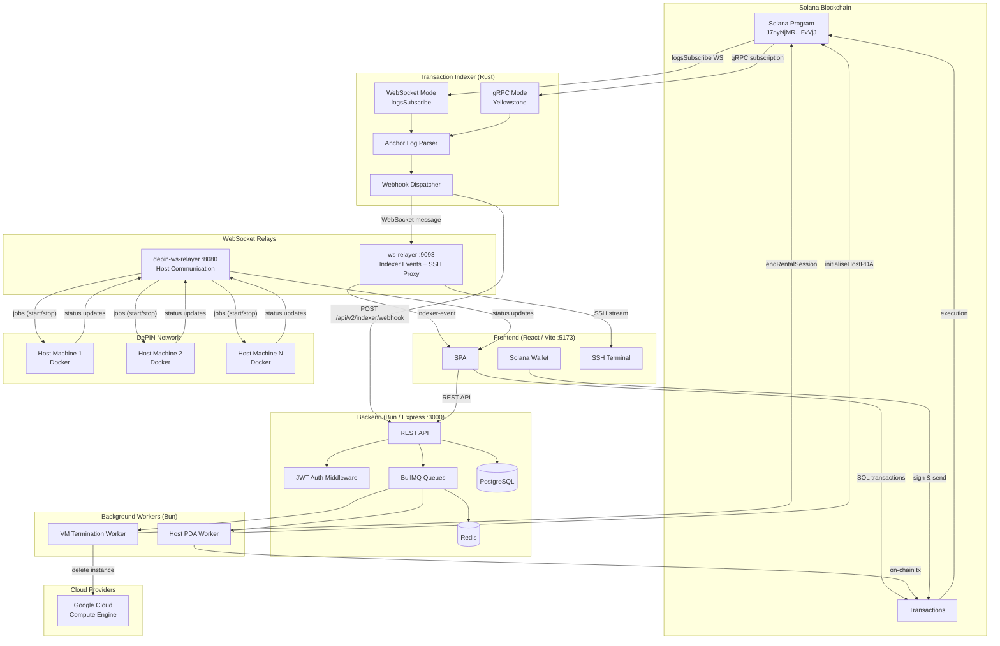
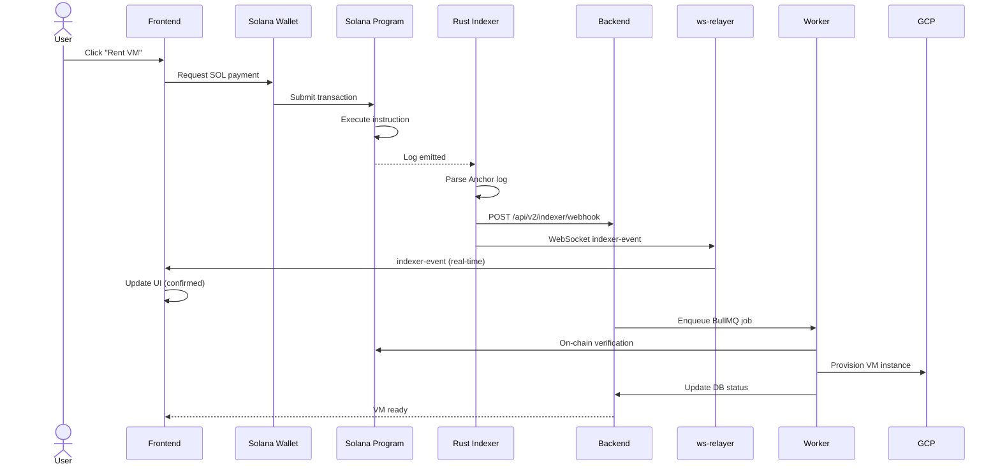
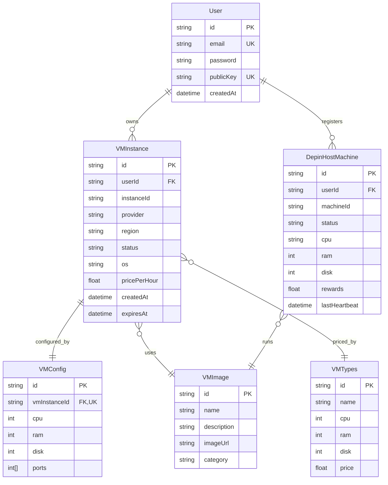

# ☁️ Axion — Decentralized Cloud Computing Platform

[](https://opensource.org/licenses/MIT)
[](https://solana.com/)
[](https://www.anchor-lang.com/)
[](https://bun.sh/)
[](https://turbo.build/)

Axion is a decentralized cloud computing platform where users rent virtual machines using **SOL tokens**. DePIN (Decentralized Physical Infrastructure Network) hosts earn SOL by sharing their compute resources. The platform combines Solana smart contracts, a Rust transaction indexer, Bun-based backend services, and a React frontend with real-time WebSocket updates.

---

## Table of Contents

- [Architecture Overview](#architecture-overview)
- [System Architecture Diagram](#system-architecture-diagram)
- [Transaction Flow](#transaction-flow)
- [Project Structure](#project-structure)
- [Tech Stack](#tech-stack)
- [Quick Start](#quick-start)
- [Environment Variables](#environment-variables)
- [API Reference](#api-reference)
- [Database Schema](#database-schema)
- [Smart Contracts](#smart-contracts)
- [Indexer](#indexer)
- [Deployment](#deployment)
- [Local Development](#local-development)
- [Testing](#testing)
- [Roadmap](#roadmap)
- [License](#license)

---

## Architecture Overview

The platform consists of five core layers:

### 1. Smart Contract Layer (Solana / Anchor)
An Anchor program deployed on Solana devnet managing:
- **VM Rentals** — escrow-based rental sessions with timed billing
- **DePIN Hosting** — host registration, activation, reward claims, and penalties
- **Admin Vault** — centralized SOL management with fund flow control

16 instructions total (11 rental + 5 DePIN), each with Borsh-serialized arguments and CPI-safe account validation.

### 2. Transaction Indexer (Rust)
A high-performance on-chain monitor that:
- Subscribes to Solana logs via WebSocket (`logsSubscribe`) or Yellowstone gRPC
- Parses Anchor instruction signatures and Borsh arguments from log strings
- Pushes parsed events to both the backend API and the WebSocket relay simultaneously

### 3. Backend Services (Bun / Express)
A RESTful API server handling:
- **User authentication** — JWT-based signup/signin with wallet verification
- **VM lifecycle** — create, read, terminate instances across GCP and DePIN providers
- **DePIN management** — host registration, status, visibility, rewards
- **Indexer ingestion** — webhook receiver for on-chain events
- **Background jobs** — BullMQ queues for async VM provisioning and chain interactions

### 4. WebSocket Relayers (Bun)
Two real-time communication servers:
- **ws-relayer** — broadcasts indexer events to frontend clients, proxies SSH terminal connections
- **depin-ws-relayer** — manages DePIN host machine connections, dispatches Docker job containers

### 5. Frontend Application (React / Vite)
A single-page application providing:
- Landing page with 3D globe visualization
- Dashboard for VM and host management
- Wallet-connected SOL payments
- Browser-based SSH terminal (xterm.js)
- Real-time updates via WebSocket subscriptions

---

## System Architecture Diagram



---

## Transaction Flow



---

## Project Structure

```
Axion/
├── contract/                        # Solana Anchor smart contracts
│   ├── programs/contract/
│   │   └── src/
│   │       ├── lib.rs              # Program entry: 16 instructions
│   │       ├── constants.rs        # PDA seeds, constants
│   │       ├── errors.rs           # Custom Anchor errors
│   │       ├── state/              # Account state structs
│   │       │   ├── vault_account.rs
│   │       │   ├── rental_session.rs
│   │       │   ├── escrow_session.rs
│   │       │   └── host_machine_registration.rs
│   │       ├── instructions/       # VM rental instructions (11)
│   │       │   ├── initialize_vault.rs
│   │       │   ├── transfer_to_vault_and_rent.rs
│   │       │   ├── transfer_from_vault.rs
│   │       │   ├── end_rental_session.rs
│   │       │   ├── fund_vault.rs
│   │       │   ├── withdraw_funds.rs
│   │       │   ├── start_rental_with_escrow.rs
│   │       │   ├── finalize_rental_escrow.rs
│   │       │   ├── top_up_escrow.rs
│   │       │   └── force_terminate_rental.rs
│   │       └── depin/              # DePIN host instructions (5)
│   │           ├── initialise_host_registration.rs
│   │           ├── activate_host.rs
│   │           ├── deactivate_host.rs
│   │           ├── claim_rewards.rs
│   │           └── penalize_host.rs
│   ├── tests/
│   │   ├── contract.ts            # Main test suite
│   │   └── depin_test.ts          # DePIN-specific tests
│   ├── Anchor.toml
│   └── Cargo.toml
│
├── indexer/                         # Rust transaction indexer
│   └── src/
│       ├── main.rs                 # Entry: mode switching
│       ├── config.rs               # Env configuration
│       ├── ws.rs                   # WebSocket logsSubscribe
│       ├── grpc.rs                 # Yellowstone gRPC (optional)
│       ├── parser.rs               # Anchor log → ParsedEvent
│       ├── instructions.rs         # Instruction discriminators
│       ├── args.rs                 # Borsh deserialization
│       └── notifier.rs             # Webhook dispatcher
│
├── web-services/                    # Turborepo monorepo (Bun)
│   ├── apps/
│   │   ├── backend/               # Express API server
│   │   │   ├── index.ts           # App entry + middleware
│   │   │   ├── routes/
│   │   │   │   ├── user.ts        # Auth routes
│   │   │   │   ├── vm.ts          # VM types & images
│   │   │   │   ├── vmInstance.ts  # VM instance CRUD
│   │   │   │   ├── depinVm.ts     # DePIN host management
│   │   │   │   └── indexer.ts     # Indexer webhook
│   │   │   └── utils/
│   │   │       ├── calculatePrice.ts
│   │   │       ├── createVm.ts
│   │   │       ├── delteVm.ts
│   │   │       └── middleware.ts
│   │   │
│   │   ├── frontend/              # React SPA (29 pages)
│   │   │   └── src/
│   │   │       ├── pages/         # Route pages
│   │   │       ├── components/    # Reusable components
│   │   │       │   ├── ui/        # shadcn primitives
│   │   │       │   ├── LandingPage/
│   │   │       │   ├── RentVm/
│   │   │       │   ├── vmDetail/
│   │   │       │   ├── DepinHostDashboard/
│   │   │       │   └── DeployImage/
│   │   │       └── lib/
│   │   │           ├── contract.ts   # Anchor client
│   │   │           ├── useTxConfirm.ts  # Indexer tx confirmation
│   │   │           ├── useIndexerEvents.ts  # WS event hook
│   │   │           ├── api.ts         # Axios client
│   │   │           └── config.ts      # Env config
│   │   │
│   │   ├── worker/               # BullMQ background jobs
│   │   │   ├── index.ts          # Queue consumers
│   │   │   └── contract.ts       # Anchor client (server-side)
│   │   │
│   │   ├── ws-relayer/           # WebSocket relay + SSH proxy
│   │   │   └── index.ts          # WS server (330 lines)
│   │   │
│   │   ├── depin-ws-relayer/     # DePIN host communication
│   │   │   └── index.ts          # WS server (205 lines)
│   │   │
│   │   └── scripts/              # Host shell scripts
│   │       ├── onboard.sh
│   │       └── verification_script.sh
│   │
│   └── packages/
│       ├── db/                   # Prisma ORM + PostgreSQL
│       │   └── prisma/schema.prisma
│       ├── types/                # Shared Zod schemas
│       ├── ui/                   # Shared React components
│       ├── utilities/            # Auth middleware, Redis
│       ├── eslint-config/
│       └── typescript-config/
│
├── ops/                           # Kubernetes manifests
│   ├── deployment.yml
│   ├── service.yml
│   ├── ingress.yml
│   ├── certificate.yml
│   └── secrets.yml
│
└── docker/                        # Dockerfiles
    ├── backend.dockerfile
    ├── frontend.dockerfile
    ├── worker.dockerfile
    ├── ws-relayer.dockerfile
    └── depin-ws-relayer.dockerfile
```

---

## Tech Stack

| Layer | Technology |
|-------|-----------|
| **Blockchain** | Solana (devnet) |
| **Smart Contracts** | Anchor Framework (Rust), Program ID: `J7nyNjMR7p9Xi8ohzkNAFmnAeVUBb1AMpGKTFGtFvVjJ` |
| **Transaction Indexer** | Rust (tokio, solana-client 2.2, Yellowstone gRPC) |
| **Monorepo Manager** | Turborepo 2.5 |
| **Package Manager** | Bun 1.2 |
| **Backend Runtime** | Bun (Express 5) |
| **Database** | PostgreSQL 16 + Prisma 7 |
| **Queue** | Redis 7 + BullMQ |
| **Frontend** | React 19 + TypeScript + Vite 7 |
| **Styling** | TailwindCSS 4 + shadcn/ui (Radix primitives) |
| **Animations** | Framer Motion (motion) + Three.js (globe) |
| **Terminal** | xterm.js + ssh2 (browser SSH) |
| **Cloud Provider** | Google Cloud Compute Engine |
| **Containerization** | Docker (multi-stage alpine) |
| **Orchestration** | Kubernetes (nginx-ingress + cert-manager) |
| **CI / Linting** | ESLint + Prettier + Husky |

---

## Quick Start

### Prerequisites

- [Bun](https://bun.sh/) >= 1.2
- [Rust](https://rustup.rs/) >= 1.88 (for indexer)
- [Anchor CLI](https://www.anchor-lang.com/docs/installation)
- [Solana CLI](https://docs.solana.com/cli/install-solana-cli-tools)
- PostgreSQL >= 16
- Redis >= 7

### 1. Smart Contract

```bash
cd contract
anchor build
anchor deploy --provider.cluster devnet
# Note the deployed program ID, update .env files
```

### 2. Database

```bash
cd web-services/packages/db
bun install
bunx prisma migrate dev
bunx prisma generate
```

### 3. Backend

```bash
cd web-services/apps/backend
bun install
cp .env.example .env     # Edit with your config
bun dev                  # :3000
```

### 4. Frontend

```bash
cd web-services/apps/frontend
bun install
bun dev                  # :5173
```

### 5. WebSocket Relayer

```bash
cd web-services/apps/ws-relayer
bun install
bun dev                  # :9093
```

### 6. DePIN WS Relayer

```bash
cd web-services/apps/depin-ws-relayer
bun install
bun dev                  # :8080
```

### 7. Worker

```bash
cd web-services/apps/worker
bun install
bun run index.ts
```

### 8. Transaction Indexer

```bash
cd indexer
cp .env.example .env
RUST_LOG=info cargo run  # WebSocket mode
# or with gRPC:
RUST_LOG=info cargo run --features grpc
```

---

## Environment Variables

### Backend

| Variable | Default | Description |
|----------|---------|-------------|
| `PORT` | `3000` | Server port |
| `DATABASE_URL` | — | PostgreSQL connection string |
| `REDIS_URL` | `redis://localhost:6379` | Redis connection |
| `JWT_SECRET` | — | JWT signing key |
| `SOLANA_RPC_URL` | `http://localhost:8899` | Solana JSON-RPC |
| `PROGRAM_ID` | — | Deployed Anchor program ID |
| `PRIVATE_KEY` | — | Admin wallet private key (base58) |
| `PROJECT_ID` | — | GCP project ID |

### Frontend

| Variable | Default | Description |
|----------|---------|-------------|
| `VITE_BACKEND_URL` | `http://localhost:3000` | Backend API URL |
| `VITE_WS_RELAYER_URL` | `ws://localhost:9093` | WebSocket relay URL |
| `VITE_SOLANA_RPC_URL` | `http://localhost:8899` | Solana RPC endpoint |
| `VITE_PROGRAM_ID` | — | Anchor program ID |

### Indexer

| Variable | Default | Description |
|----------|---------|-------------|
| `MODE` | `ws` | `ws` or `grpc` |
| `SOLANA_WS_URL` | `wss://api.devnet.solana.com` | Solana WebSocket endpoint |
| `SOLANA_HTTP_URL` | `https://api.devnet.solana.com` | Solana HTTP endpoint |
| `PROGRAM_ID` | — | Program ID to monitor |
| `BACKEND_WEBHOOK_URL` | — | Backend webhook URL |
| `WS_RELAYER_URL` | — | ws-relayer URL |

---

## API Reference

### User Authentication

| Method | Path | Description |
|--------|------|-------------|
| `POST` | `/api/v2/user/signup` | Create account |
| `POST` | `/api/v2/user/signin` | Authenticate |
| `GET` | `/api/v2/user/profile` | Get profile (auth) |

### VM Instances

| Method | Path | Description |
|--------|------|-------------|
| `POST` | `/api/v2/vmInstance/create` | Provision new VM |
| `GET` | `/api/v2/vmInstance/:id` | Get instance details |
| `PUT` | `/api/v2/vmInstance/:id` | Update configuration |
| `DELETE` | `/api/v2/vmInstance/:id` | Terminate instance |
| `GET` | `/api/v2/vmInstance/user/:userId` | List user's instances |

### VM Catalog

| Method | Path | Description |
|--------|------|-------------|
| `GET` | `/api/v2/vm/types` | Available VM types |
| `GET` | `/api/v2/vm/images` | Available images |
| `POST` | `/api/v2/vm/deploy` | Deploy from image |

### DePIN Host Management

| Method | Path | Description |
|--------|------|-------------|
| `POST` | `/api/v2/user/depin/register` | Register host machine |
| `POST` | `/api/v2/user/depin/changeVisibility` | Toggle host visibility |
| `GET` | `/api/v2/user/depin/getAll` | List all hosts |
| `GET` | `/api/v2/user/depin/getById/:id` | Get host details |
| `POST` | `/api/v2/user/depin/claimSOL` | Claim host rewards |
| `POST` | `/api/v2/user/depin/depinVerification` | Verify host machine |

### Indexer Webhook

| Method | Path | Description |
|--------|------|-------------|
| `POST` | `/api/v2/indexer/webhook` | Receive parsed on-chain events |
| `GET` | `/api/v2/indexer/status` | Indexer health |

---

## Database Schema



---

## Smart Contracts

### Program ID (devnet)
```
J7nyNjMR7p9Xi8ohzkNAFmnAeVUBb1AMpGKTFGtFvVjJ
```

### Instructions

#### VM Rental (11)

| # | Instruction | Description |
|---|-------------|-------------|
| 1 | `initialize_vault` | Create admin vault PDA |
| 2 | `transfer_to_vault_and_rent` | Deposit SOL + start rental |
| 3 | `transfer_from_vault` | Settle payment + end rental |
| 4 | `end_rental_session` | Complete rental period |
| 5 | `fund_vault` | Top up admin vault |
| 6 | `withdraw_funds` | Withdraw from admin vault |
| 7 | `start_rental_with_escrow` | Begin escrow rental |
| 8 | `finalize_rental_escrow` | Settle escrow payment |
| 9 | `top_up_escrow` | Add funds to active escrow |
| 10 | `force_terminate_rental` | Admin-terminate rental |

#### DePIN Host (5)

| # | Instruction | Description |
|---|-------------|-------------|
| 11 | `initialise_host_registration` | Register host machine PDA |
| 12 | `activate_host` | Enable host for requests |
| 13 | `deactivate_host` | Disable host |
| 14 | `claim_rewards` | Withdraw earned SOL rewards |
| 15 | `penalize_host` | Deduct SOL for SLA violations |

### State Accounts

| Account | Seeds | Fields |
|---------|-------|--------|
| `VaultAccount` | `b"vault"` | admin, total_deposited, total_withdrawn, bump |
| `RentalSession` | `b"rental", user_key, vm_id` | user, vm_id, provider, start_time, end_time, amount_deposited, is_active, is_escrow |
| `EscrowSession` | `b"escrow", user_key, vm_id` | user, vm_id, amount_escrowed, rate_per_slot, start_slot, last_top_up_slot, status |
| `HostMachineRegistration` | `b"host", host_key, machine_id` | host, machine_id, status, cpu, ram, disk, rewards_earned, last_claim |

---

## Indexer

The Rust indexer is the backbone of real-time transaction confirmation:

```
                        ┌──────────────┐
  Solana Validator ────▶│  logsSubscribe │
                        └──────┬───────┘
                               │ raw log
                               ▼
                        ┌──────────────┐
                        │   parser.rs   │
                        │ Anchor log →  │
                        │ ParsedEvent   │
                        └──────┬───────┘
                               │
                    ┌──────────┴──────────┐
                    ▼                     ▼
            ┌──────────────┐    ┌──────────────┐
            │  notifier.rs  │    │  notifier.rs  │
            │ POST to       │    │ WS send to    │
            │ backend       │    │ ws-relayer    │
            └──────────────┘    └──────────────┘
                    │                     │
                    ▼                     ▼
            ┌──────────────┐    ┌──────────────┐
            │   Backend    │    │  ws-relayer   │
            │ stores event │    │ broadcasts   │
            │ in DB        │    │ to frontend   │
            └──────────────┘    └──────────────┘
```

The indexer supports two transport modes:
- **WebSocket (default)** — `logsSubscribe` RPC method, connects to Solana WS endpoint
- **gRPC (optional)** — Yellowstone gRPC geyser for production-grade streaming, enabled with `--features grpc`

---

## Deployment

### Kubernetes

```bash
# Apply all manifests
kubectl apply -f ops/

# Verify
kubectl get pods -n decloud
kubectl get ingress -n decloud
```

### Domains

| URL | Service |
|-----|---------|
| `https://decloud.krishlabs.tech` | Frontend |
| `https://api.decloud.krishlabs.tech` | Backend API |
| `wss://wss.decloud.krishlabs.tech` | WebSocket relay |
| `wss://wss.depin.decloud.krishlabs.tech` | DePIN WS relay |

### Docker Images

All images are multi-stage builds on `oven/bun:alpine`:

| Service | Image | Dockerfile |
|---------|-------|-----------|
| Backend | `krishanand01/decloud-backend:v2.1` | `docker/backend.dockerfile` |
| Frontend | `krishanand01/decloud-frontend:v2.2` | `docker/frontend.dockerfile` |
| Worker | `krishanand01/decloud-worker:v2.1` | `docker/worker.dockerfile` |
| WS Relayer | `krishanand01/decloud-ws-relayer:v1.1` | `docker/ws-relayer.dockerfile` |
| DePIN WS | `krishanand01/decloud-depin-ws-relayer:v2.1` | `docker/depin-ws-relayer.dockerfile` |

---

## Local Development

### Full Local Stack

```bash
# Terminal 1: Solana test validator
solana-test-validator
# airdrop SOL: solana airdrop 100 <ADMIN_WALLET> --url http://localhost:8899

# Terminal 2: Backend
cd web-services/apps/backend && bun dev

# Terminal 3: Frontend
cd web-services/apps/frontend && bun dev

# Terminal 4: WS Relayer
cd web-services/apps/ws-relayer && bun dev

# Terminal 5: Indexer (adjust .env to point at localhost)
cd indexer && RUST_LOG=info cargo run

# Terminal 6: Worker
cd web-services/apps/worker && bun run index.ts

# Terminal 7: DePIN WS Relay
cd web-services/apps/depin-ws-relayer && bun dev

# Services needed: PostgreSQL (port 5432), Redis (port 6379)
```

### Monorepo Commands

```bash
# From web-services/
bun install                  # Install all workspace deps
turbo build                  # Build all packages + apps
turbo dev                    # Start all in dev mode
turbo lint                   # Lint all (except worker)
turbo lint --filter=frontend # Lint specific app
turbo build --filter=backend # Build specific app
```

---

## Testing

```bash
# Smart Contract tests
cd contract && anchor test

# Frontend (if configured)
cd web-services/apps/frontend && bun run test

# Backend
cd web-services/apps/backend && bun run test
```

---

## Roadmap

### v3.0 (Future)
- AI-powered resource optimization
- Cross-chain payment support (Ethereum, Polygon)
- Decentralized storage integration (Filecoin, Arweave)
- Advanced security features (SGX enclaves)
- Spot instance market for unused capacity
- Mobile app (React Native)

---

## License

MIT — see [LICENSE](LICENSE).

Copyright 2026 Krish Anand
